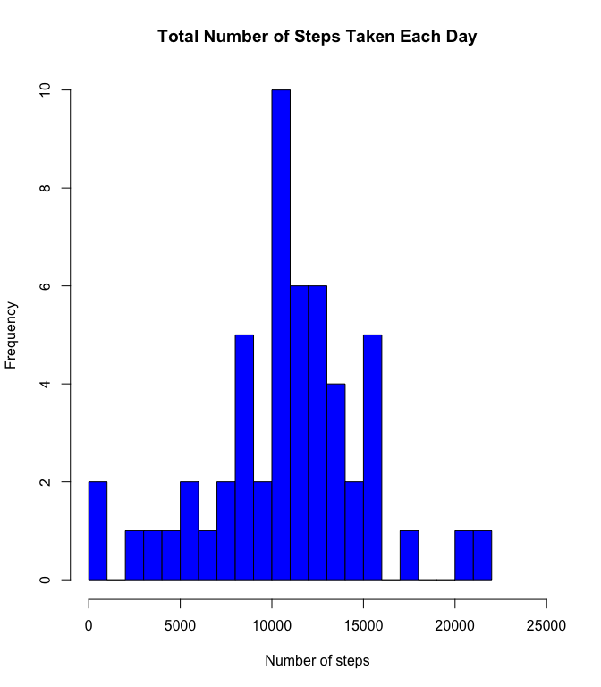
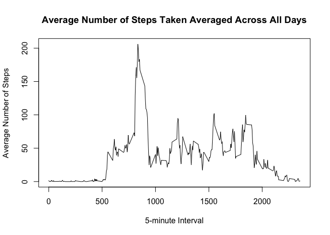
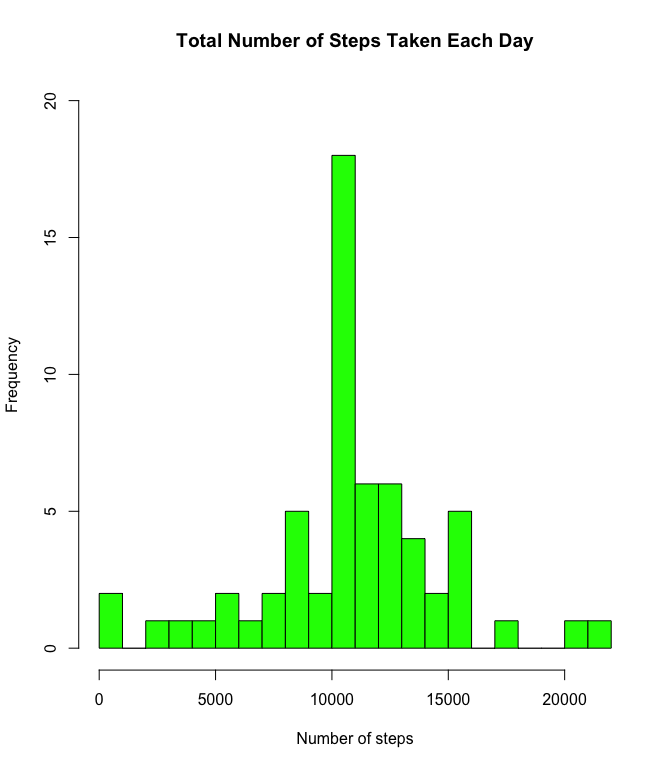

#Peer Assessment 1

##Loading and preprocessing the data


```r
setwd("/Users/Kanchanah/Documents/ReproducibleResearch/PeerAssessment1")
data <- read.table("activity.csv", header=T,sep=",")
```

##What is mean total number of steps taken per day?

Total number of steps taken per day

```r
aggdata <-aggregate(steps~date,data=data,sum, na.rm=TRUE)
```

Histogram of the total number of steps taken each day

```r
hist(aggdata$steps,xlab="Number of steps",col="blue",main="Total Number of Steps Taken Each Day",breaks=20,xlim=c(0,25000))
```

 

Calculate and report the mean and median of the total number of steps taken per day


```r
stepsmean<-format(round(mean(aggdata$steps),2),nsmall=2)
stepsmedian<-format(round(median(aggdata$steps),2),nsmall=2)
```
The mean of the total number of steps taken per day is 10766.19. The median of the total number of steps taken per day is 10765.00.

##What is the average daily activity pattern?

Average number of steps taken, averaged across all days

```r
aggmean <-aggregate(steps~interval,data=data,mean, na.rm=TRUE)
```

Time series plot of the 5-minute interval (x-axis) and the average number of steps taken, averaged across all days (y-axis)


```r
plot(aggmean$interval,aggmean$steps,type="l",main="Average Number of Steps Taken Averaged Across All Days",xlab="5-minute Interval",ylab="Average Number of Steps")
```

 

Which 5-minute interval, on average across all the days in the dataset, contains the maximum number of steps?


```r
maxsteps<-aggmean$interval[which.max( aggmean[,2] )]
```
The interval 835 contains the maximum number of steps.

##Imputing missing values

Calculate and report the total number of missing values in the dataset (i.e. the total number of rows with NAs)


```r
missing<-sum(!complete.cases(data))
```
The total number of missing values is 2304

Devise a strategy for filling in all of the missing values in the dataset. The strategy does not need to be sophisticated. For example,you could use the mean/median for that day, or the mean for that 5-minute interval, etc.


```r
stepReplace<-data.frame(data$steps)
stepReplace[is.na(stepReplace),] <- tapply(X=data$steps,INDEX=data$interval,FUN=mean,na.rm=TRUE)
```

Create a new dataset that is equal to the original dataset but with the missing data filled in.


```r
newdata<-cbind(stepReplace,data[c(2,3)])
colnames(newdata)<-c(names(data))
```

Aggregate the data


```r
agg_newdata<-aggregate(steps~date,newdata,sum)
```

Make a histogram of the total number of steps taken each day


```r
hist(agg_newdata$steps,xlab="Number of steps",col="green",main="Total Number of Steps Taken Each Day",breaks=20,ylim=c(0,20))
```

 

Calculate and report the mean and median total number of steps taken per day


```r
stepsmean_newdata<-format(round((mean(agg_newdata$steps)),2),nsmall=2)
stepsmedian_newdata<-format(round(median(agg_newdata$steps),2),nsmall=2)
```
The mean of the total number of steps taken per day for the the new dataset is 10766.19. The median of the total number of steps taken for the new dataset per day is 10766.19.

The results indicate that the mean remains unchanged.However, the median has increased and matches the mean. 

Hence, the impact of imputing missing data on the on the estimates of the total daily number of steps is that the means remain the same while the median changed.

##Are there differences in activity patterns between weekdays and weekends?

Create a new factor variable in the dataset with two levels – “weekday” and “weekend” indicating whether a given date is a weekday or weekend day.


```r
newdata$date <- as.Date(newdata$date, "%Y-%m-%d")
newdata$day<-weekdays(newdata$date)
newdata$day[newdata$day%in%c("Monday","Tuesday","Wednesday","Thursday","Friday")]<-c("Weekday")
newdata$day[newdata$day%in%c("Saturday","Sunday")]<-c("Weekend")
newdata$day<-as.factor(newdata$day)
```

Panel plot containing a time series plot of the 5-minute interval (x-axis) and the average number of steps taken, averaged across all weekday days or weekend days


```r
steps_by_interval<- aggregate(steps ~ interval + day, newdata, mean)
library(lattice)
```

```
## Warning: package 'lattice' was built under R version 3.1.3
```

```r
xyplot(steps_by_interval$steps~ steps_by_interval$interval|steps_by_interval$day, main="Average Steps per Day by Interval",xlab="Interval", ylab="Steps",layout=c(1,2), type="l")
```

 
